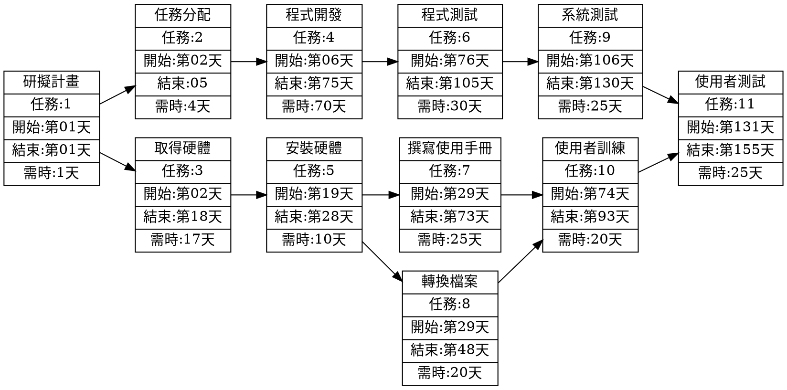
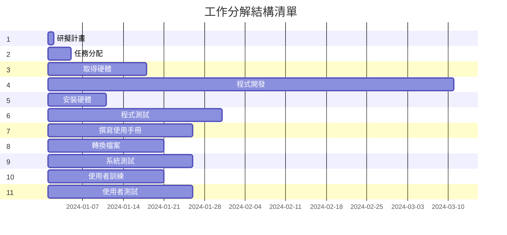

```graphviz
digraph {
	node[shape=record];
	rankdir="LR";
    no1 [label = "研擬計畫 | 任務:1 | 開始:第01天 | 結束:第01天 | 需時:1天"]
    no2 [label = "任務分配 | 任務:2 | 開始:第02天 | 結束:05 | 需時:4天"]
    no3 [label = "取得硬體 | 任務:3 | 開始:第02天 | 結束:第18天 | 需時:17天"]
    {rank=same;no2 no3}
    no1->no2
    no1->no3
    no4 [label = "程式開發 | 任務:4 | 開始:第06天 | 結束:第75天 | 需時:70天"]
    no2->no4
    no5 [label = "安裝硬體 | 任務:5 | 開始:第19天 | 結束:第28天 | 需時:10天"]
    no3->no5
    no6 [label = "程式測試 | 任務:6 | 開始:第76天 | 結束:第105天 | 需時:30天"]
    no4->no6
    no7 [label = "撰寫使用手冊 | 任務:7 | 開始:第29天 | 結束:第73天 | 需時:25天"]
    no8 [label = "轉換檔案 | 任務:8 | 開始:第29天 | 結束:第48天 | 需時:20天"]
    {rank=same;no7 no8}
    no5->no7
    no5->no8
    no9 [label = "系統測試 | 任務:9 | 開始:第106天 | 結束:第130天 | 需時:25天"]
    no6->no9
    no10 [label = "使用者訓練 | 任務:10 | 開始:第74天 | 結束:第93天 | 需時:20天"]
    no7->no10
    no8->no10
    no11 [label = "使用者測試 | 任務:11 | 開始:第131天 | 結束:第155天 | 需時:25天"]
    no9->no11
    no10->no11
	
}
```
# hw2

## Mermaid

```mermaid
gantt
    title 工作分解結構清單

    section 1
    研擬計畫       :a1, 2024-01-01, 1d
    section 2
    任務分配      :2024-01-01  , 4d
    section 3
    取得硬體      :2024-01-01  , 17d
    section 4
    程式開發      :2024-01-01  , 70d
    section 5
    安裝硬體      :2024-01-01  , 10d
    section 6
    程式測試      :2024-01-01  , 30d
    section 7
    撰寫使用手冊   :2024-01-01  , 25d
    section 8
    轉換檔案      :2024-01-01  , 20d
    section 9
    系統測試      :2024-01-01  , 25d
    section 10
    使用者訓練      :2024-01-01  , 20d
    section 11
    使用者測試      :2024-01-01  , 25d
```
