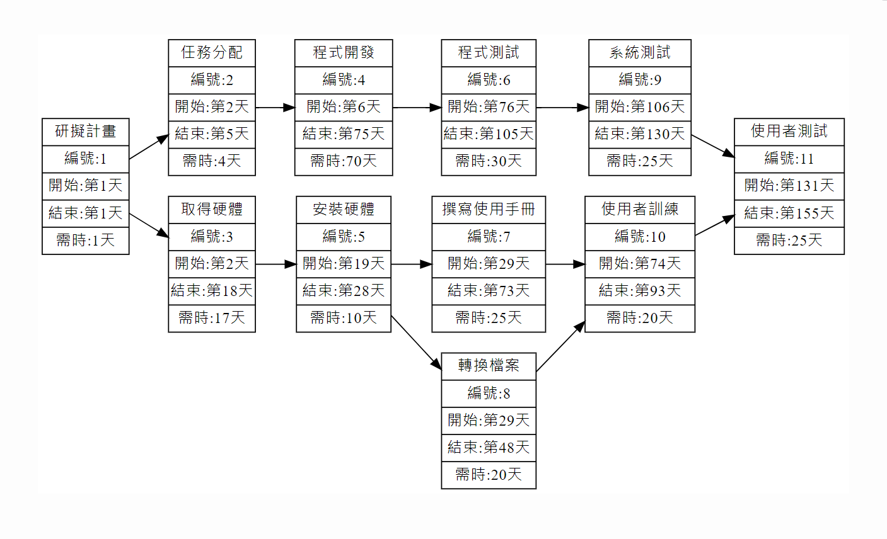
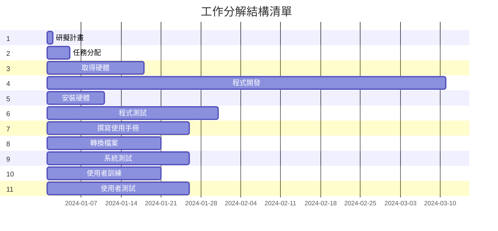

# hw2
## Pert

## Mermaid

```mermaid
gantt
    title 工作分解結構清單

    section 1
    研擬計畫       :a1, 2024-01-01, 1d
    section 2
    任務分配      :2024-01-01  , 4d
    section 3
    取得硬體      :2024-01-01  , 17d
    section 4
    程式開發      :2024-01-01  , 70d
    section 5
    安裝硬體      :2024-01-01  , 10d
    section 6
    程式測試      :2024-01-01  , 30d
    section 7
    撰寫使用手冊   :2024-01-01  , 25d
    section 8
    轉換檔案      :2024-01-01  , 20d
    section 9
    系統測試      :2024-01-01  , 25d
    section 10
    使用者訓練      :2024-01-01  , 20d
    section 11
    使用者測試      :2024-01-01  , 25d
```
